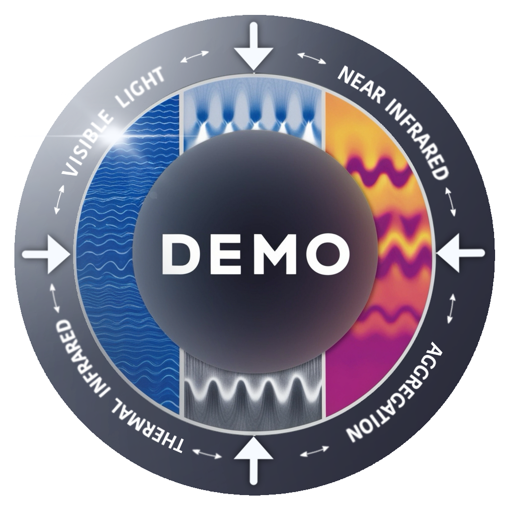
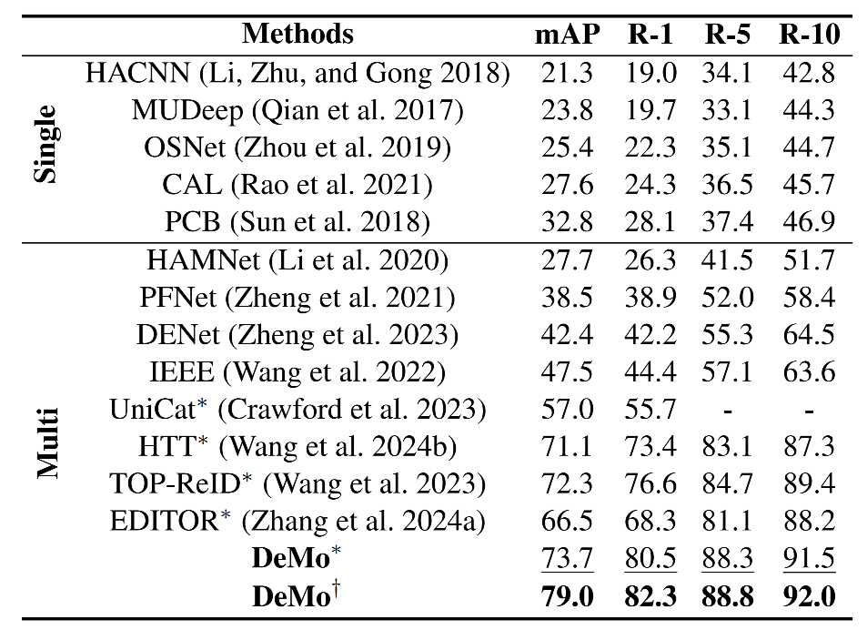
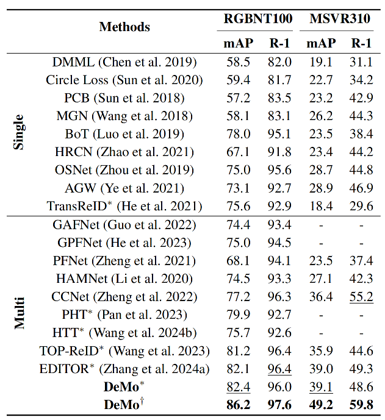
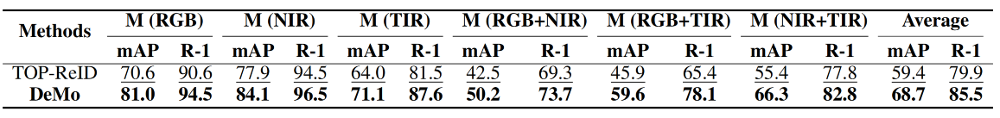
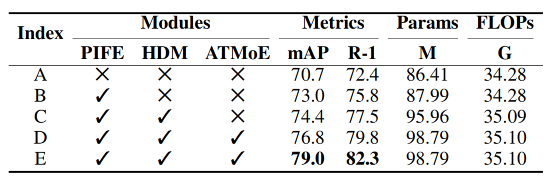
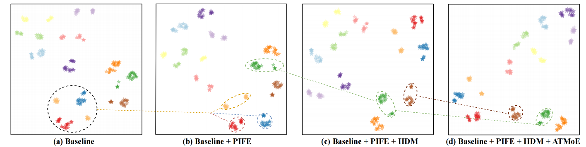
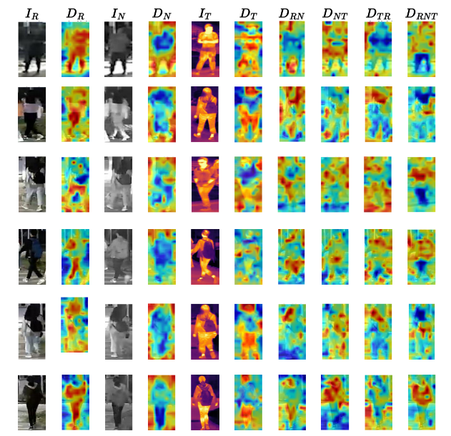

<p align="center">

  <h1 align="center">DeMo: Decoupled Feature-Based Mixture of Experts for Multi-Modal Object Re-Identification</h1>
  <p align="center">
    
  <p align="center">

[//]: # (  <p align="center">)

[//]: # (    )

[//]: # (  <p align="center">)
  <p align="center">
    <a href="https://scholar.google.com/citations?user=WZvjVLkAAAAJ&hl=zh-CN" rel="external nofollow noopener" target="_blank"><strong>Yuhao Wang</strong></a>
    ·
    <a href="https://dblp.org/pid/51/3710-66.html" rel="external nofollow noopener" target="_blank"><strong>Yang Liu</strong></a>
    ·
    <a href="https://ai.ahu.edu.cn/2022/0407/c19212a283203/page.htm" rel="external nofollow noopener" target="_blank"><strong>Aihua Zheng</strong></a>
    ·
    <a href="https://scholar.google.com/citations?user=MfbIbuEAAAAJ&hl=zh-CN" rel="external nofollow noopener" target="_blank"><strong>Pingping Zhang*</strong></a>
  </p>
<p align="center">
    <a href="https://arxiv.org/pdf/2412.10650" rel="external nofollow noopener" target="_blank">AAAI 2025 Paper</a>

<p align="center">
    
</p>

**DeMo** is an advanced multi-modal object Re-Identification (ReID) framework designed to tackle dynamic imaging quality variations across modalities. By employing decoupled features and a novel Attention-Triggered Mixture of Experts (ATMoE), DeMo dynamically balances modality-specific and modality-shared information, enabling robust performance even under missing modality conditions. The framework sets new benchmarks for multi-modal and missing-modality object ReID.

## News
- We released the **DeMo** codebase and paper! 🚀 [Paper](https://arxiv.org/pdf/2412.10650)
- Great news! Our paper has been accepted to **AAAI 2025**! 🎉
---

## Table of Contents
- [Introduction](#introduction)
- [Contributions](#contributions)
- [Results](#results)
- [Visualizations](#visualizations)
- [Reproduction](#reproduction)
- [Citation](#citation)

---

## **Introduction**

Multi-modal object ReID combines the strengths of different modalities (e.g., RGB, NIR, TIR) to achieve robust identification across challenging scenarios. **DeMo** introduces a decoupled approach using Mixture of Experts (MoE) to preserve modality uniqueness and enhance diversity. This is achieved through:
1. **Patch-Integrated Feature Extractor (PIFE)**: Captures multi-granular representations.
2. **Hierarchical Decoupling Module (HDM)**: Separates modality-specific and shared features.
3. **Attention-Triggered Mixture of Experts (ATMoE)**: Dynamically adjusts feature importance with adaptive attention-guided weights.

---

## **Contributions**

- Introduced a decoupled feature-based MoE framework, **DeMo**, addressing dynamic quality changes in multi-modal imaging.
- Developed the **Hierarchical Decoupling Module (HDM)** for enhanced feature diversity and **Attention-Triggered Mixture of Experts (ATMoE)** for context-aware weighting.
- Achieved state-of-the-art performance on RGBNT201, RGBNT100, and MSVR310 benchmarks under both full and missing-modality settings.

---

## **Results**
### Multi-Modal Object ReID
#### Multi-Modal Person ReID [RGBNT201]
<p align="center">
  
</p>

#### Multi-Modal Vehicle ReID [RGBNT100 & MSVR310]
<p align="center">
    
</p>

### Missing-Modality Object ReID
#### Missing-Modality Performance [RGBNT201]
<p align="center">
    
</p>

#### Missing-Modality Performance [RGBNT100]
<p align="center">
    
</p>

### Ablation Studies [RGBNT201]
<p align="center">
    
</p>

---

## **Visualizations**

### Feature Distribution (t-SNE)
<p align="center">
    
</p>

### Decoupled Features
<p align="center">
    
</p>

### Rank-list Visualization
<p align="center">
    
</p>

---

## **Reproduction**

### Datasets
- **RGBNT201**: [Google Drive](https://drive.google.com/drive/folders/1EscBadX-wMAT56_It5lXY-S3-b5nK1wH)  
- **RGBNT100**: [Baidu Pan](https://pan.baidu.com/s/1xqqh7N4Lctm3RcUdskG0Ug) (Code: `rjin`)  
- **MSVR310**: [Google Drive](https://drive.google.com/file/d/1IxI-fGiluPO_Ies6YjDHeTEuVYhFdYwD/view?usp=drive_link)

### Pretrained Models
- **ViT-B**: [Baidu Pan](https://pan.baidu.com/s/1YE-24vSo5pv_wHOF-y4sfA)  (Code: `vmfm`)
- **CLIP**: [Baidu Pan](https://pan.baidu.com/s/1YPhaL0YgpI-TQ_pSzXHRKw) (Code: `52fu`)

### Configuration
- RGBNT201: `configs/RGBNT201/DeMo.yml`  
- RGBNT100: `configs/RGBNT100/DeMo.yml`  
- MSVR310: `configs/MSVR310/DeMo.yml`


### Training
```bash
conda create -n DeMo python=3.8.12 -y 
conda activate DeMo
pip install torch==1.13.1+cu117 torchvision==0.14.1+cu117 torchaudio==0.13.1+cu117 --extra-index-url https://download.pytorch.org/whl/cu117
cd (your_path)
pip install -r requirements.txt
python train_net.py --config_file configs/RGBNT201/DeMo.yml
```
### Notes
- This repository is based on [MambaPro](https://github.com/924973292/MambaPro). The prompt and adapter tuning on the CLIP backbone are reserved (the corresponding hyperparameters are set to `False`), allowing users to explore them independently.  
- This code provides multi-modal Grad-CAM visualization, multi-modal ranking list generation, and t-SNE visualization tools to facilitate further research.  
- The hyperparameter configuration is designed to ensure compatibility with devices equipped with less than 24GB of memory.   
- Thank you for your attention and interest!

---

## Star History

[](https://star-history.com/#924973292/DeMo&Date)

---

## **Citation**

If you find **DeMo** helpful in your research, please consider citing:
```bibtex
@inproceedings{wang2025DeMo,
  title={DeMo: Decoupled Feature-Based Mixture of Experts for Multi-Modal Object Re-Identification},
  author={Wang, Yuhao and Liu, Yang and Zheng, Aihua and Zhang, Pingping},
  booktitle={Proceedings of the AAAI Conference on Artificial Intelligence},
  year={2025}
}
```

